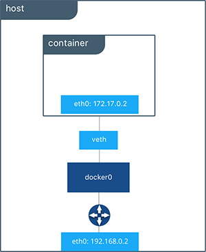
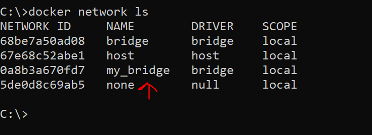
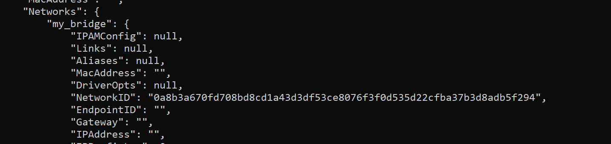

[text](flask-demo-app/Docker-compose.yaml)# Docker Networking
### Everything you need to know about Networking in Docker.
Well Networking concepts are same, just need to brush up your knowledge and how Docker is using networking. 

As we know Docker is helping to create create isolated environment from your host VM to run applications on containers. 
**Official Doc: [doc.docker.com](https://docs.docker.com/engine/network/)**

## Problem Statement:
Lets say you have deployed an application which is using databases, backend and frontend and when you deploy on containers, how it will be communicate. 
 - Networking allows containers to communicate with each other and with the host system. Containers run isolated from the host system and need a way to communicate with each other and with the host system.

 By default, Docker provides two network drivers for you, the bridge and the overlay drivers.
 ```
 docker network ls
 ```
 ```
NETWORK ID          NAME                DRIVER
xxxxxxxxxxxx        none                null
xxxxxxxxxxxx        host                host
xxxxxxxxxxxx        bridge              bridge
```
**Bridge Networking -** This is default network mode when you create container, by default docker attached bridge network interface to containers, which create an isolated environment from host machine which means I will not able to ping container IP from host machine. 
**Then how docker engine handles request, if host machine is not able to interact with container in bridge mode?**

Well technically, when you installed docker on your machine, docker engine create a virtaul eth(veth0) interface on your host machine and created 2 drives(bridge and overlay)



If you want to make it secure containers and isolated from your host OS, then you need to use bridge Networking. 

Lets create our own Bridge Network. 
```
docker network create -d bridge my_bridge
```


This new network can be attached to the containers, when you run these containers.

```
docker run -d --net=my_bridge --name test hello-world
```
You can also inspect the container,network, volume by using inspect command. 
```
docker inspect test
```


So technically, if I am running multiple containers based on my application requirement like Databases, frontend, backend containers. I can attached my network-driver on runtime and all containers will able to communicate to each other and will be isolated to hostOS. 

**For example**
 - Database container will assign - 172.17.0.2
 - Frontend container will assign - 172.17.0.3
 - Backend container will assign  - 172.17.0.4 

So All of them in same IP range and will able to communicate. 

However, you can at any point of time, attach the first container to my_bridge network and enable communication
```
docker network connect my_bridge web
```

## Host Networking
Another concept is host networking. This mode allows containers to share the host system's network stack, providing direct access to the host system's network.

To attach a host network to a Docker container, you can use the --network="host" option when running a docker run command. When you use this option, the container has access to the host's network stack, and shares the host's network namespace. This means that the container will use the same IP address and network configuration as the host.

Here's an example of how to run a Docker container with the host network:

```
docker run --network="host" <image_name> <command>
```
Keep in mind that when you use the host network, the container is less isolated from the host system, and has access to all of the host's network resources. This can be a security risk, so use the host network with caution.

Additionally, not all Docker image and command combinations are compatible with the host network, so it's important to check the image documentation or run the image with the --network="bridge" option (the default network mode) first to see if there are any compatibility issues.

## Overlay Networking
This mode enables communication between containers across multiple Docker host machines, allowing containers to be connected to a single network even when they are running on different hosts.

## Macvlan Networking
This mode allows a container to appear on the network as a physical host rather than as a container.

