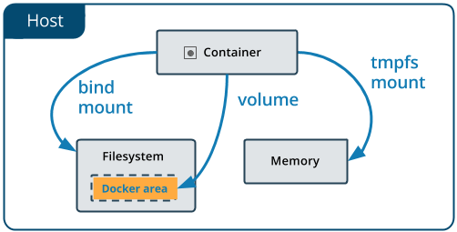
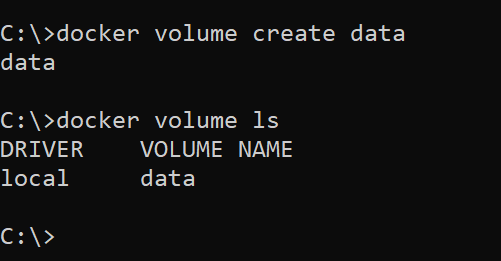
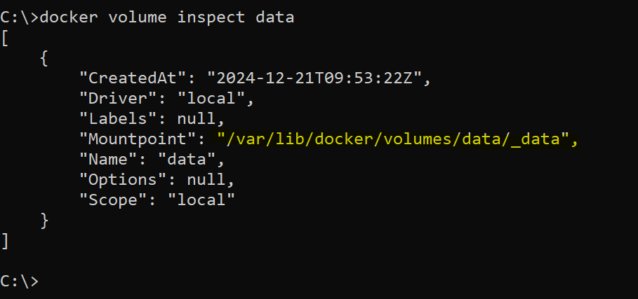
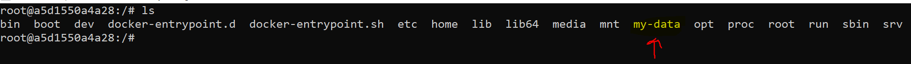

# Docker Volumes 
## Problem Statement
It is a very common requirement to persist the data in a Docker container beyond the lifetime of the container. However, the file system of a Docker container is deleted/removed when the container dies.

#### There are 2 different ways how docker solves this problem.

- Volumes
- Bind Directory on a host as a Mount

Volumes aims to solve the same problem by providing a way to store data on the host file system, separate from the container's file system, so that the data can persist even if the container is deleted and recreated.



Volume or PV can created and managed with docker commands. 

```
docker volume create <volume_name>
```


You can also inspect that, so see the mounted but this is virtual pristent volume. 

```
docker volume inspect <volume_name>
```


**Now lets create container and attached this volume**
```
docker run -it -v <volume_name>:/my-data <image_name> /bin/bash
```


If my container dies, still my data will be store in volume and I can attached. 

Another thing, you can attached 1 volume to multiple container and shared resources. 

## Bind Directory on a host as a Mount

Bind mounts also aims to solve the same problem but in a complete different way.

Using this way, user can mount a directory from the host file system into a container. Bind mounts have the same behavior as volumes, but are specified using a host path instead of a volume name.

For example,
```
docker run -it -v <host_path>:<container_path> <image_name> /bin/bash
```

#### Key Differences between Volumes and Bind Directory on a host as a Mount

Volumes are managed, created, mounted and deleted using the Docker API. However, Volumes are more flexible than bind mounts, as they can be managed and backed up separately from the host file system, and can be moved between containers and hosts.

In a nutshell, Bind Directory on a host as a Mount are appropriate for simple use cases where you need to mount a directory from the host file system into a container, while volumes are better suited for more complex use cases where you need more control over the data being persisted in the container.