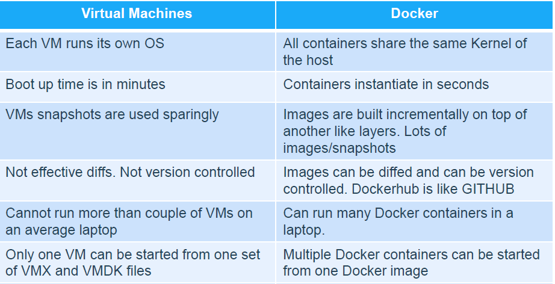
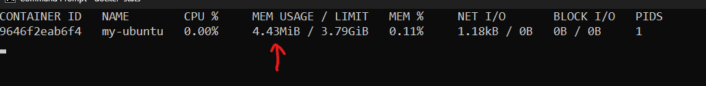
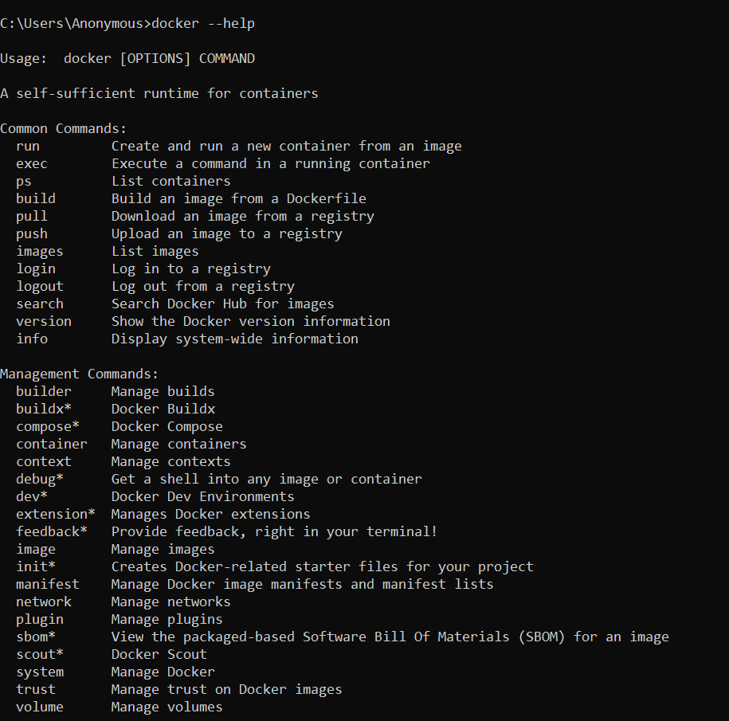
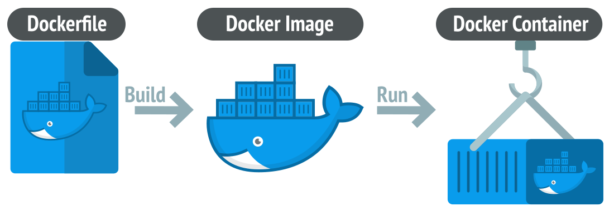
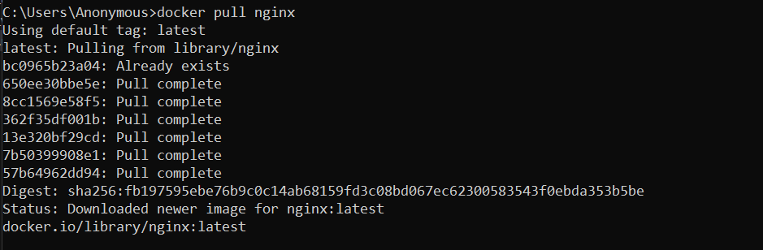
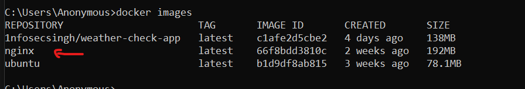
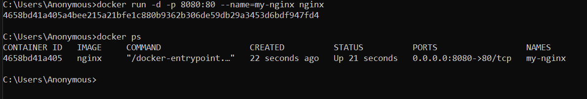

# Docker Zero to Hero

## What is Docker?
- Docker is a software platform that allows you to build, test, and deploy applications quickly.
- Docker is an open source, which helps to deploy apps on containers instead of using virtual machines

### Difference between Docker and VM 


- Technically Docker used Host OS resources to run applications, however VM have it's own OS and Kernel. 
- Docker is good for deploying app fast and accessible from anywhere, because when you create Docker image, you can push into artifacts like docker hub, ECR or wherever you want, then you can pull and create containers. 
- In VM, case, it is not easy but possible with VM images, but again it is not easy! 
- Docker used less resources as compare to use VMs, so if I want to run an application, I will just focused on application arhitecture. 

### Technical Comparison 
I launched Ubuntu in container and you can see, it is only taking 4mbps RAM from my Host OS, if I used VM, it is required at least 1.5 GB RAM to run Ubuntu.
So, docker only scale the resource whenever it is required, as compare to VMs, you need to define the resources even if it is not in used, you will have to assign those resources. 



## Lets learn how to use Docker. 

If you are using Linux as a HostOS, then you already have it for Windows, you need to install docker desktop. 

You might have question, why we need to install **Docker Desktop**?

So, Docker as technology can only be run on Linux OS.
**Docker Desktop does 2 things:**
1. Creates Linux VM(WSL) on your host OS (Windows / Mac)
2. Technically Windows Kernel is different then Linux, to solve that problem, you need a platform to make it work, so Docker Desktop create Linux kernel, to handle I/O from user and give the env to run container. 


### Lets install docker and run first container. 
- Installation Guide - [doc.docker.com](https://docs.docker.com/engine/install/)
- Once you have installed, you can launch docker desktop or run docker command in cli. 
- I would also recommend, you can create account in docker hub, so that later on we can publish our docker images and use it from anywhere. 

### Docker CLI 
- You can launch CMD, and run ``Docker --help``
help command, have all other commands reference which we will going to cover. 



## Docker Container Vs Docker Image.
**Lets deep dive into Docker container and image**
Most of the people don't understand the difference between docker container and image. 

- Containers create with Docker Images. 
- Docker images are built with docker instructions, the instructions contains application requirements and dependency. 
- Docker image is the template loaded onto the container to run it, like a set of instructions. You store images for sharing and reuse, but you create and destroy containers over an application's lifecycle.



**Dockerfile:** it is a set of instructions for creating image, lets say I want to create an application in python, then I want to containerized that application, so I will write my application dependencey and built docker image, with docker image, I can run 'N' number of containers.

We will create Dockerfile later on but to learn fast, we will use available images from docker hub. 

**Visit the docker hub - [hub.docker.com](https://hub.docker.com/search)**

- These official images useful for reuse instead of writing dockerfile. lets say I needed Nginx Server for my Web App, I can use Nginx image directly by using pull command. 

> For example: docker pull "image-name"

**Lets pull nginx image and create our first container**
```
docker pull nginx
```


**If you want to check your images, run below command.**
```
docker images
```


**So, we have image but we need to create container with image**
>For example: docker run [OPTIONS] IMAGE [COMMAND] [ARG...]

**Lets create container.**
```
docker run -d -p 8080:80 --name=my-nginx nginx
```

>Now you can access Nginx, with https://localhost:8080


**Let's break down above command**
- **docker run:** when you want to run first time container with docker image.
- **-d:** detech the container from terminal, and print the container id. 
- **-p:** Specify the port, as you see I mentioned 8080:80
    - Containers are isolated from your network, so If you want to expose the container, then you need to bind container port with HostOS port. 
    - So, you are saying I am binding my hostOS port with container port and similar way, you are discribing HOST-PORT:CONTAINER-PORT. 
    - Make sure, you must know about the container port where your application is running and hostOS port also, in case you are not able to access your application via specific port, then check your hostOS if that port is available or not. 
- **--name:** You can specify the application name, it is optional. 
- **image:** Mentioned the image. 

**There are more arguments available on Docker official website, you may read the documentation -- > [docs.docker.com](https://docs.docker.com/reference/cli/docker/container/run/)**